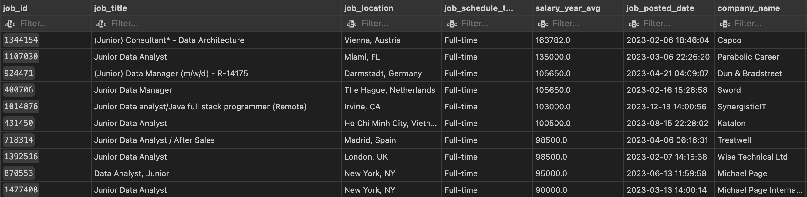
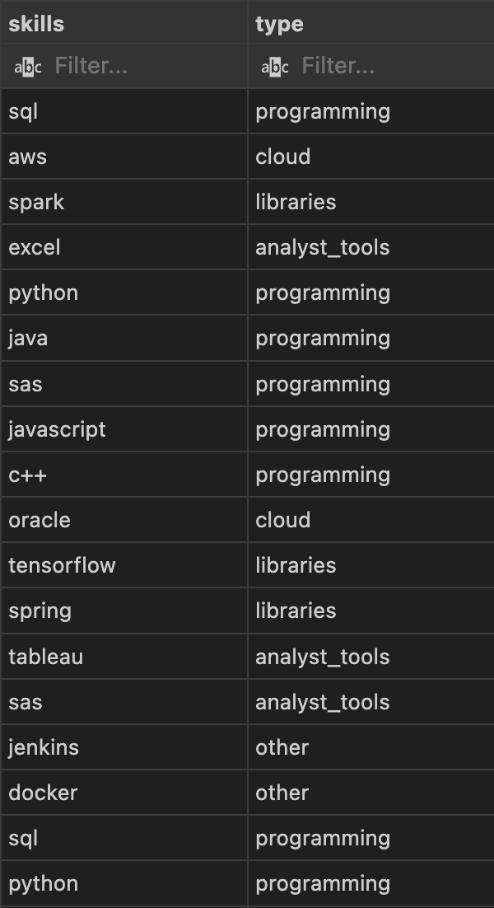
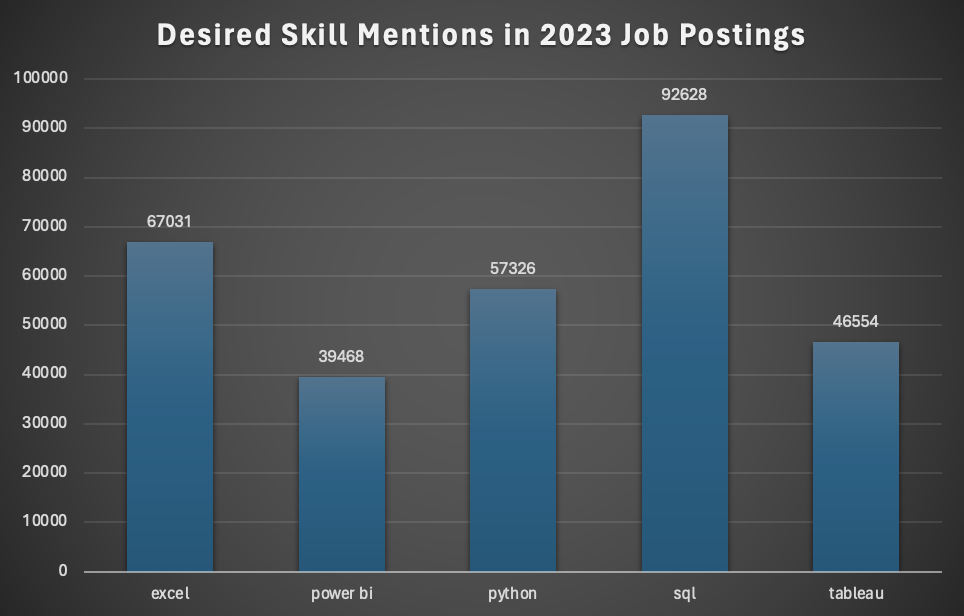
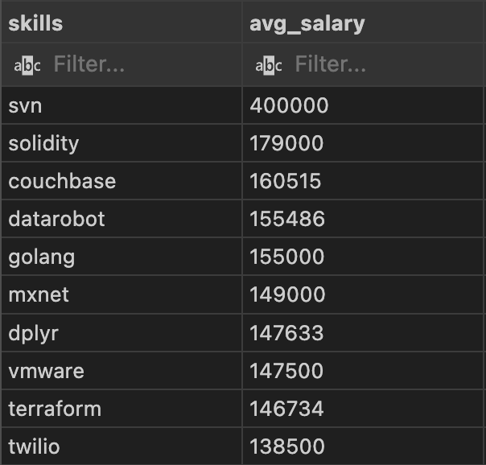
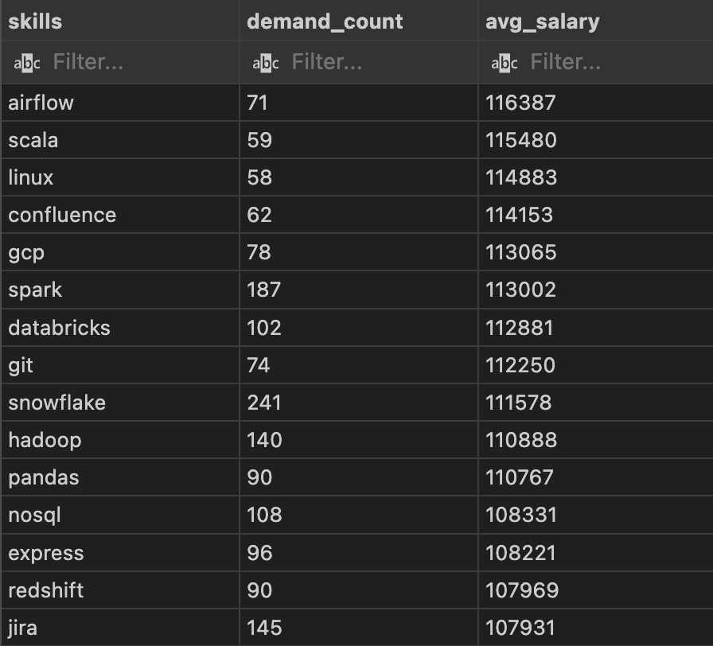

# Introduction
In this project I explored the job market in 2023 for data careers. With a focus on data analyst roles, the aim was to uncover valuable insights into the skills and salaries for these jobs. 

The project set out to answer 5 questions:

    1. What are the top-paying data analyst jobs?
    
    2. What skills are required for these top-paying jobs?

    3. What are the most demanded skills for data analysts?

    4. What skills are associated with higher salaries?

    5. What are the most optimal skills to learn?

The SQL queries are here: [project_sql folder](/project_sql/)

# Background
This project is part of the [SQL for Data Analysis course](/https://www.lukebarousse.com/sql) by Luke Barousse and Kelly Adams.

# Tools I used

**SQL:**
    Querying the database and uncovering insights were achieved using only SQL.

**PostgreSQL:**
    The DBMS for handling the data.

**Visual Studio Code:**
    Wherein the SQL was executed.

**Git & GitHub:**
    For version control and for sharing.

# The Data
The project utilized four relational tables by which the data job market was explored.

**Job Postings Table:**

This table formed the backbone to the analysis, containing detailed job postings data the table, named job_postings_fact,was pivotal to understanding the trends in the job market.

**Company Table:**

This table stored information about the companies who are advertising the postings. 

**Skills Table:**

This table contained the sought after skills in the data job market and a classification to assist in skill categorisation.

**Skills Job Link Table:**

The skills to job table contained the relationships between the sought after skills and job postings.
# The Analysis
Each query set out to answer each of the questions investigating the job market. 

### 1. Top Paying Data Analyst Jobs:
In this query, I was exploring what the highest paying jobs for data analysts were, specifically, junior data analyst roles as that is currently my area of interest. I chose not to filter Australian results here due to a high number of null values in the salary data which could have compromised accuracy of the results.
```sql
SELECT
    job_id,
    job_title,
    job_location,
    job_schedule_type,
    salary_year_avg,
    job_posted_date,
    name AS company_name
FROM
    job_postings_fact
LEFT JOIN company_dim ON company_dim.company_id = job_postings_fact.company_id
WHERE
    job_title_short LIKE '%Data%Analyst%' AND
    job_title LIKE '%Junior%' AND
    salary_year_avg IS NOT NULL
ORDER BY
    salary_year_avg DESC
    LIMIT 10
; 


/* 
Important to note that this only includes postings 
where salary is not null, i.e. not disclosed on the ad */
```


**Key findings:**

**Wide Salary Range:** The top 10 results from postings worldwide ranged from €163,782 (USD$178,401) to USD$90,000 indicating diversity among top entry level positions.

**Locational Diversity:**
The top paying entry level data analyst positions are not limited to one geographical area, instead they are spread across multiple continents. 
### 2. Skills for Top Paying Jobs:
To understand what skills are required for these top paying jobs, I joined the job postings table with the skills data table which provided insights into what employers value for high-compensation junior roles. 


```sql
WITH top_paying_jobs AS (
    SELECT
        job_id,
        job_title,
        salary_year_avg,
        name AS company_name
    FROM
        job_postings_fact
    LEFT JOIN company_dim ON job_postings_fact.company_id = company_dim.company_id
    WHERE
        job_title_short = 'Data Analyst' AND
        job_title LIKE '%Junior%' AND
        salary_year_avg IS NOT NULL
    ORDER BY
        salary_year_avg DESC
    LIMIT 10
)

SELECT
top_paying_jobs.*,
skills,
type
FROM top_paying_jobs
INNER JOIN skills_job_dim ON top_paying_jobs.job_id = skills_job_dim.job_id
INNER JOIN skills_dim ON skills_job_dim.skill_id = skills_dim.skill_id
ORDER BY
salary_year_avg DESC;
```


**Key Findings:**

The results of this query shows the dominance of programming languages remaining key in high paying junior roles. 

Cloud platform knowledge appears to be on the rise with mentions of AWS and Oracle among the list.

Analyst tools such as Excel and Tableau remain desirable skills among Junior DAs.

## 3. Top Demanded Skills

In the next query, I broadened the search criteria to include all data analyst job postings in the database, to uncover the most demanded skills for data analysts.
```SQL
SELECT 
    skills,
    COUNT(skills_job_dim.job_id) AS demand_count
FROM job_postings_fact
INNER JOIN skills_job_dim ON job_postings_fact.job_id = skills_job_dim.job_id
INNER JOIN skills_dim ON skills_job_dim.skill_id = skills_dim.skill_id
WHERE job_title_short = 'Data Analyst'
GROUP BY skills
ORDER BY demand_count DESC
LIMIT 5;

```
I then exported a CSV of the results and created a simple pivot chart in Excel to better visualise the findings.



## 4. Top Paying Skills

In this query, I set out to find which skills would provide a competitive advantage in the job market and are associated with high compensation roles.
```SQL
SELECT 
    skills,
    ROUND(AVG(salary_year_avg), 0) AS avg_salary
FROM job_postings_fact
INNER JOIN skills_job_dim ON job_postings_fact.job_id = skills_job_dim.job_id
INNER JOIN skills_dim ON skills_job_dim.skill_id = skills_dim.skill_id
WHERE  
    job_title_short = 'Data Analyst' AND
    salary_year_avg IS NOT NULL
GROUP BY skills
ORDER BY 
        avg_salary DESC
LIMIT 10;
```




## Insights found:
Discounting SVN, which appears to be an error in the data as SVN (Apache Subversion) is a version control software not typically associated with the role of a data analyst, we can see a trend in the remaining data.

It appears that specialist knowledge within areas such as blockchain development using Solidity ($179k), or packages within languages such as dplyr ($147k) are highly compensated. 

The same can be said for niche software platform knowledge where we see skills in Couchbase ($160k), a cloud database platform, and Datarobot ($155k), both boasting high earning potential. 
 
 ## 5. Optimal Skills to Learn

In this final query, I explored what skills are most optimal to learn for a data analyst. To determine this, the dataset was filtered by both skill demand and average salary to determine the skills which skills were both desired and highly compensated. The SQL query and results for this final question are below. 

```SQL

WITH skills_demand AS (
    SELECT 
        skills_dim.skill_id,
        skills_dim.skills,
        COUNT(skills_job_dim.job_id) AS demand_count
    FROM job_postings_fact
    INNER JOIN skills_job_dim ON job_postings_fact.job_id = skills_job_dim.job_id
    INNER JOIN skills_dim ON skills_job_dim.skill_id = skills_dim.skill_id
    WHERE job_title_short = 'Data Analyst'
    AND salary_year_avg IS NOT NULL
    GROUP BY skills_dim.skill_id
), average_salary AS (
    SELECT
        skills_job_dim.skill_id,
        ROUND(AVG(job_postings_fact.salary_year_avg), 0) AS avg_salary
    FROM job_postings_fact
    INNER JOIN skills_job_dim ON job_postings_fact.job_id = skills_job_dim.job_id
    INNER JOIN skills_dim ON skills_job_dim.skill_id = skills_dim.skill_id
    WHERE  
    job_title_short = 'Data Analyst'
    AND salary_year_avg IS NOT NULL
    GROUP BY skills_job_dim.skill_id
)

SELECT
    skills_demand.skills,
    demand_count,
    avg_salary
FROM
    skills_demand
INNER JOIN average_salary ON skills_demand.skill_id = average_salary.skill_id
WHERE
    demand_count >  50
ORDER BY
        avg_salary DESC
        
LIMIT 15;

```
Filtering the skills by demand count of greater than 50 and sorting by descending salary, we uncover an interesting insight into some high compensation and demanded skills. 



These results offer interesting insight into the skills that attract high earning potential and are high in demand. 

Salary differences between those skills topping the list (airflow, scala), and those in highest demand (snowflake, spark) are only separated by around $5k annual salary. 

Airflow, Snowflake and GCP; tools used for managing big data, are highly sought after and well compensated by employers. 


# Conclusions

This project set out to uncover some insights about the job market for data analysts, specifically, what skills are highly valued by employers. 

To summarise, the data suggests that the demand for foundational data analysis skills remains strong, with SQL, Excel and Python still expected and valued. 
The landscape is changing however, with cloud tools increasing in value from employers and expertise in managing big data on the rise. Data analysts wanting to maximise the earning potential of their profession should look towards expertise within niche areas of the field. 

# Reflection

This project enabled me to practice and develop my knowledge of SQL, particularly my knowledge of CTEs and joins, while also uncovering insights relevant to my position which I will benefit from, moving forward.

I have learned what is required in terms of skillset to achieve my goal of becoming a data analyst, and in doing so, have built a portfolio project to further assist in seeing that goal accomplished.

